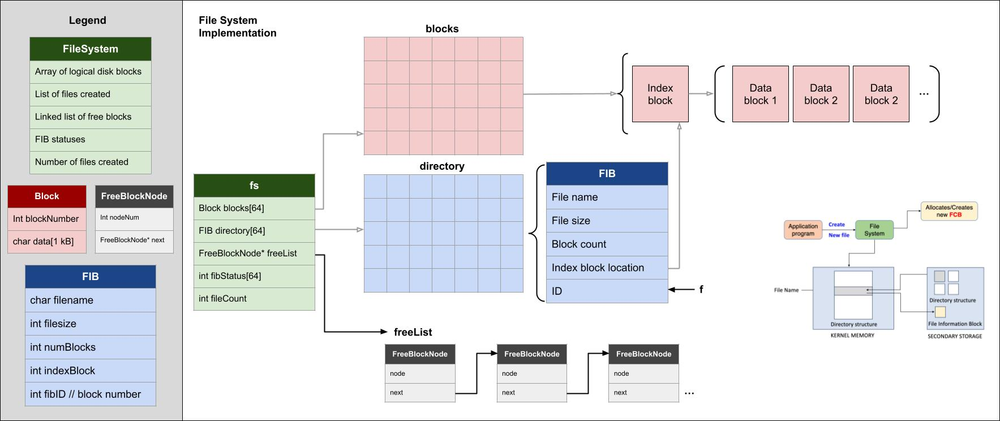

# Indexed File System Simulator

## Overview

This project is a simulation of an **indexed file system implemented in C**.  
It demonstrates how an operating system can manage files using **blocks, indexing, and free space management**.

Each file is stored using:
- One index block (FIB)
- Multiple data blocks
- A free block linked list for allocation and deallocation

## Specifications

- Fixed-size block storage system  
- Indexed file allocation (1 index block per file points to N data blocks)
- File creation with block allocation
- File deletion with block deallocation
- Root directory listing with formatted output
- Free blocks managed dynamically using a linked list

# Core Components

### File Index Block (FIB)

Each file has a FIB that stores:
- Filename
- File size in bytes
- Number of data blocks used
- List of allocated block indices
- Unique FIB ID

### Free Block List

- Implemented as a **singly linked list**
- Tracks all available blocks
- Updated on allocation and deallocation

### File System Structure

- Directory of FIB entries, stored as an array
- Free block head pointer
- File count

## Build Instructions

Compile the project using the provided Makefile:
** make **

## Run Instructions
Run the simulator:
**./fs_sim**
or 
** make run **

## Clean Build Files
** make clean **

# Example Output

# Project Structure
.
├── main.c
├── fs_indexed.c
├── fs_indexed.h
├── Makefile
├── file_system_diagram.jpg
└── README.md

# Author
Madeline LeBreton
