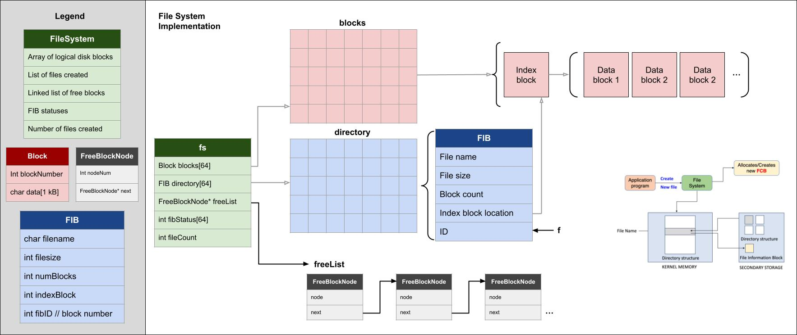

# Indexed File System Simulator

## Overview

This project is a simulation of an **indexed file system implemented in C**.
It demonstrates how an operating system can manage files using **blocks, indexing, and free space management**.

Each file is stored using:
- One **index block (FIB)**
- Multiple **data blocks**
- A **free block linked list** for allocation and deallocation

## Specifications

- Fixed-size block storage system
- Indexed file allocation (1 index block per file points to N data blocks)
- File creation with block allocation
- File deletion with block deallocation
- Root directory listing with formatted output
- Free blocks managed dynamically using a linked list

## Core Components



### File Index Block (FIB)
Each file has a FIB that stores:
- Filename
- File size in bytes
- Number of data blocks used
- List of allocated block indices
- Unique FIB ID

### Free Block List
- Implemented as a **singly linked list**
- Tracks all available blocks
- Updated on allocation and deallocation

### File System Structure
- Directory of FIB entries, stored as an array
- Free block head pointer
- File count

## Build Instructions

Compile the project using the provided Makefile:

```bash
make
```

## Run Instructions

Run the simulator:

```bash
./fs_sim
```

Or:

```bash
make run
```

## Clean Build Files

```bash
make clean
```

## Sample Output

```
File system initialized with 64 blocks of 1024 bytes each.
File 'alpha.txt' created with 3 data blocks + 1 index block.
File 'beta.txt' created with 5 data blocks + 1 index block.

Root directory listing (2 files):
 alpha.txt  |  3072 bytes  |  3 data blocks |  FIBID=0
 beta.txt  |  5120 bytes  |  5 data blocks |  FIBID=1

Free blocks (54): [10] -> [11] -> [12] -> ... -> [63] -> NULL
File 'alpha.txt' deleted
...
```

## Project Structure

```
.
├── main.c
├── fs_indexed.c
├── fs_indexed.h
├── Makefile
├── file_system_diagram.jpg
└── README.md
```

---

## Author

Madeline LeBreton
